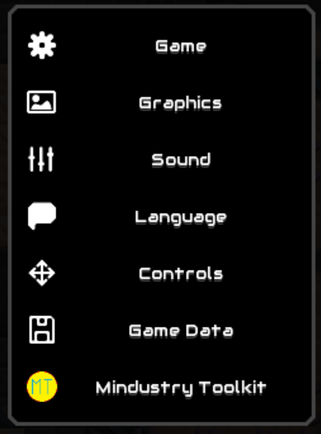
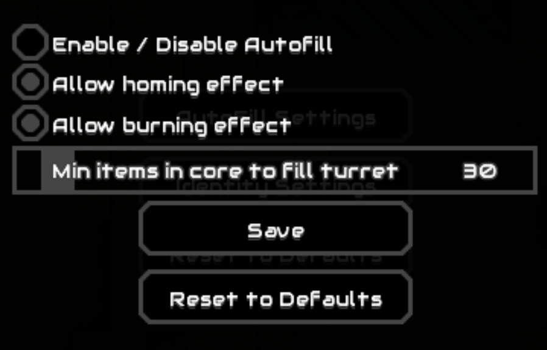

# Mindustry Toolkit

A Java Mindustry mod that consists of multiple parts called 'features' eg. AutoFill, Identity and later others (suggest
new features ;-D)

## Settings

You can find Mindustry Toolkit settings obviously in the bottom category called 'Mindustry Toolkit'


## AutoFill

Inspired by [this mods](https://github.com/Ferlern/extended-UI-v7) AutoFill.
But better, with lots of settings, so you can customize ammo filled to turrets and much more.
I'm planning also feature that will work like processor + container + flare, its contents will be moved to core and / or
it will be filled from core.


## Sectorized

Adds some useful features when playing on Sectorized server.

To check if you're connecting to Sectorized server, the server's ip or address and port are compared with the following list:
- 89.58.37.204:6567
- sectorized.freeddns.org:6567

Features are:
- Change cost of vaults depending on current core cost (requires /hud to be toggled on)
- Disables / bans vault after placing it, so you don't get the annoying core place timeout message

## Identity

Inspired by Ukrainian player called Igor, who can change his UUID on server, so server thinks he's different user. By
that way Igor managed to spam [Sectorized](https://github.com/Pointifix/SectorizedPlugin) server's leaderboard with
Igors.

You can create user 'accounts', quickly switch between them in-game without restarting your client, it will only kick
you from server and reconnect back, so server can be told different UUID => different player

Account has 3 parameters

- Name - Player's name
- USID - Player's USID (Unique Server IDentificator - the identity server checks, unique for every IP address)
- UUID - Player's UUID (Unique User IDentificator, unique for every player - same for all servers)

If you manage to get somebody's USID and/or UUID, you can create user with his name and USID he gave you and pretend to be him, it's
like stealing somebody's Minecraft account, BUT the USID is only working on one server, normal user has unique USID on
every single server, you can read your USID for server with this code in console:

```javascript
// To get your Sectorized uuid you do this:
Core.settings.getString("usid-89.58.37.204:6567", "No USID found :-(")
// For OmniDustry:
Core.settings.getString("usid-109.94.209.233:6567", "No USID found :-(")
// Others:
Core.settings.getString("usid-<serverIP>:<serverPORT(default:6567)>", "No USID found :-(")
```